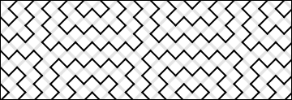
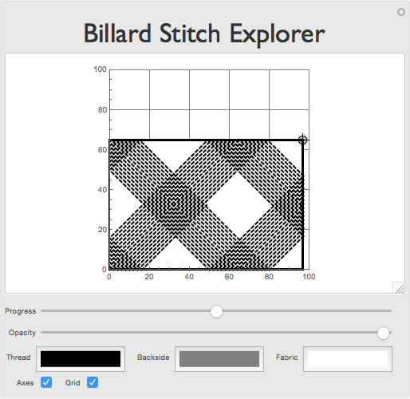

# Billard Embroidery

Exploring the fractal structures that arise from running stitch embroidery in polygon billards.  
Those fractals were discovered by Sergey Gerasimov and are described on his [website](http://xcont.com/).

## Things to Try

    BillardPlot[35,12]
   

    
    BillardExplorer[]
    

## Code 

Check out the code [here](billard-embroidery.m).

## Links

* [Javascript Version](http://xcont.com/pattern.html) (by Sergey Gerasimov)
* [Mathematical Billards](http://mathworld.wolfram.com/Billiards.html) (from MathWorld)
* [Donald Learns how to play billards](https://www.youtube.com/watch?v=yuntK56wL7A) (from Donald in Mathmagic Land, Walt Disney 1959)
